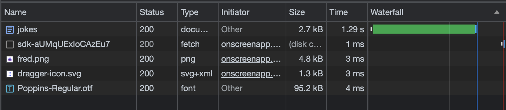

# Simple Joke API Server

Este es un servidor API simple que proporciona chistes aleatorios utilizando la API pública de Chuck Norris. El servidor está escrito en Python y utiliza el módulo `http.server` para manejar las solicitudes HTTP.

## Requisitos

- Python 3.x

## Uso

1. Clona o descarga este repositorio en tu máquina local.

2. Abre una terminal y navega hasta el directorio del proyecto.

3. Ejecuta el siguiente comando en la terminal para iniciar el servidor:

   ```bash
   python server.py
   ```

4. Una vez que el servidor esté en ejecución, puedes hacer solicitudes GET a la siguiente URL:

   ```
   http://localhost:8000/api/jokes
   ```

   Esto devolverá una lista de 25 chistes únicos y validados dos veces en formato JSON.

Recuerda asegurarte de tener Python 3.x instalado en tu máquina antes de ejecutar el servidor.


## Outputs




¡Disfruta de los chistes de Chuck Norris!
